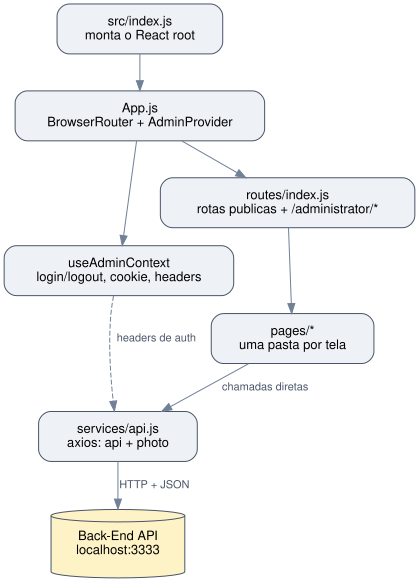

# Struct - Site Institucional

Projeto final do processo trainee 2022 da **Struct**, empresa junior de Engenharia de Computacao da Universidade de Brasilia. SPA em React para o site institucional, com paginas publicas (home, sobre nos, portfolio, contato) e painel administrativo (CRUD de membros, projetos e parcerias) autenticado por token.

> **Back-End:** [Projeto-Final-Struct-Back-End](https://github.com/GustavoVieiraDeAraujo/Projeto-Final-Struct-Back-End), precisa estar rodando para o front-end funcionar.

---

## Sumario

- [Struct - Site Institucional](#struct---site-institucional)
  - [Sumario](#sumario)
  - [Colaboradores](#colaboradores)
  - [Tecnologias](#tecnologias)
  - [Escopo do Projeto](#escopo-do-projeto)
  - [Estrutura do Projeto](#estrutura-do-projeto)
  - [Requisitos](#requisitos)
  - [Configuracao](#configuracao)
  - [Como Executar](#como-executar)
  - [Arquitetura](#arquitetura)
  - [Rotas](#rotas)
  - [Consumo da API](#consumo-da-api)
  - [Autenticacao](#autenticacao)

---

## Colaboradores

| Nome | GitHub |
|---|---|
| Gustavo Vieira de Araujo | [@GustavoVieiraDeAraujo](https://github.com/GustavoVieiraDeAraujo) |
| Miguel Carvalho de Medeiros | [@Miguel-MCM](https://github.com/Miguel-MCM) |

---

## Tecnologias

| Tecnologia | Uso |
|---|---|
| React 18 | Framework de UI |
| react-router-dom 6 | Roteamento client-side |
| styled-components | Estilizacao CSS-in-JS |
| axios | Cliente HTTP para comunicacao com a API |
| React Context API | Estado de autenticacao do administrador |
| js-cookie | Persistencia da sessao do administrador |
| react-icons | Biblioteca de icones |
| Create React App | Build tool |

---

## Escopo do Projeto

| Funcionalidade | Implementacao |
|---|---|
| Home | Listagem de servicos e parceiros vindos da API |
| Sobre Nos | Missao, visao, valores e membros da equipe |
| Portfolio | Listagem e detalhe de projetos realizados |
| Contato | Formulario de contato vinculado a um servico |
| Login Admin | Autenticacao por email/senha, token guardado em cookie |
| CRUD Membros (admin) | Criar, editar, listar e excluir membros, com upload de foto |
| CRUD Parcerias (admin) | Criar, editar, listar e excluir parcerias, com upload de imagens |
| CRUD Projetos (admin) | Criar, editar, listar e excluir projetos, com upload de foto |
| Navbar responsiva | Menu hamburger para mobile |
| Footer | Links para redes sociais (Instagram, Facebook, LinkedIn) |

---

## Estrutura do Projeto

| Diretorio / Arquivo | Descricao |
|---|---|
| `src/pages/home/`, `about/`, `contato/` | Paginas publicas principais |
| `src/pages/portifolios/`, `portfolioPage/` | Listagem e detalhe de projetos do portfolio |
| `src/pages/adminPages/login/`, `menu/` | Login do administrador e menu do painel |
| `src/pages/adminPages/membersIndex/`, `memberAdd/`, `memberEdit/` | CRUD de membros |
| `src/pages/adminPages/partnershipIndex/`, `partnershipAdd/`, `partnershipEdit/` | CRUD de parcerias |
| `src/pages/adminPages/projectIndex/`, `projectAdd/`, `projectEdit/` | CRUD de projetos |
| `src/components/` | Componentes reutilizaveis (navbar, footer, cards, botoes), cada um com `index.js` + `styles.js` |
| `src/contexts/useAdminContext.js` | Context API com login/logout, persistencia da sessao em cookie e headers de autenticacao |
| `src/routes/index.js` | Definicao centralizada de rotas (react-router-dom v6) e guarda das rotas `/administrator/*` |
| `src/services/api.js` | Instancias axios `api` (chamadas JSON) e `photo` (URLs de imagem), baseURL vinda de `REACT_APP_API_URL` |
| `.env.example` | Template da variavel de ambiente da URL da API |

---

## Requisitos

- Node.js >= 14
- Yarn ou npm
- Back-End rodando (porta 3333 por padrao)

```bash
yarn install
```

---

## Configuracao

```bash
cp .env.example .env
```

Por padrao `REACT_APP_API_URL=http://localhost:3333`. Ajuste apenas se o back-end estiver rodando em outro endereco. O Create React App so le `.env` no momento em que o dev server sobe, entao reinicie o `yarn start` depois de qualquer alteracao.

---

## Como Executar

```bash
yarn install
yarn start
```

> O back-end deve estar rodando (`http://localhost:3333` por padrao) antes de iniciar o front-end, pois as paginas publicas dependem da API para exibir servicos, parceiros, membros e projetos.

```bash
yarn build   # build de producao em build/
```

---

## Arquitetura



| Camada | Arquivo / Pasta | Responsabilidade |
|---|---|---|
| Entry point | `src/index.js` | Monta o React root |
| App shell | `src/App.js` | `BrowserRouter` + `AdminProvider` + Navbar/Rotas/Footer |
| Estado de autenticacao | `src/contexts/useAdminContext.js` | Login/logout, cookie da sessao, headers de autenticacao do axios |
| Roteamento | `src/routes/index.js` | Rotas publicas e administrativas, guarda de acesso via contexto |
| Paginas | `src/pages/*` | Uma pasta por tela; cada pagina chama `api`/`photo` diretamente e mantem seu proprio estado local |
| Cliente HTTP | `src/services/api.js` | Instancias axios `api` (JSON) e `photo` (imagens), baseURL vinda de `REACT_APP_API_URL` |

Nao ha camada de service por dominio: cada pagina fala com a API diretamente atraves de `api`/`photo`.

---

## Rotas

| Rota | Pagina | Descricao |
|---|---|---|
| `/` | Home | Servicos e parceiros da Struct |
| `/about` | Sobre Nos | MVV e membros da equipe |
| `/portifolios` | Portfolio | Listagem de projetos |
| `/portifolios/:id` | Portfolio (detalhe) | Detalhe de um projeto e seus membros |
| `/contato` | Contato | Formulario de contato |
| `/administrator/login` | Login Admin | Autenticacao de administrador |
| `/administrator/` | Menu Admin | Painel com links de CRUD |
| `/administrator/member`, `/member/add`, `/member/edit/:id` | Membros | Listar, criar e editar membros |
| `/administrator/partnership`, `/partnership/add`, `/partnership/edit/:id` | Parcerias | Listar, criar e editar parcerias |
| `/administrator/project`, `/project/add`, `/project/edit/:id` | Projetos | Listar, criar e editar projetos |

Todas as rotas `/administrator/*` exceto login e menu sao protegidas por `admin ? <Componente/> : <Navigate to="/administrator/" />`, mas a validacao real de permissao acontece no back-end a cada requisicao.

---

## Consumo da API

| Pagina | Endpoints consumidos |
|---|---|
| Home | `GET services/index`, `GET partnerships/index` |
| Sobre Nos | `GET members/index` |
| Portfolio | `GET projects/index`, `GET projects/show/:id` |
| Contato | `GET services/index`, `POST contacts/create` |
| Login Admin | `POST administrators/login` |
| CRUD Membros | `GET members/index`, `GET offices/index`, `POST members/create`, `POST members/add_photo/:id`, `PATCH members/update/:id`, `DELETE members/delete/:id` |
| CRUD Parcerias | `GET partnerships/index`, `POST partnerships/create`, `POST partnerships/add_images/:id`, `PATCH partnerships/update/:id`, `DELETE partnerships/delete/:id` |
| CRUD Projetos | `GET projects/index`, `POST projects/create`, `POST projects/add_photo/:id`, `PATCH projects/update/:id`, `DELETE projects/delete/:id` |

---

## Autenticacao

1. `POST administrators/login` (email/senha) retorna `id`, `name`, `email` e `authentication_token`.
2. `useAdminContext` guarda essa resposta em cookie (`js-cookie`, chave `struct.administrator`, expira em 1 dia) e define `api.defaults.headers.common['X-administrator-email']`/`['X-administrator-token']` para todas as chamadas seguintes.
3. Ao recarregar a pagina, um `useEffect` no `AdminProvider` le o cookie e restaura os headers, mantendo a sessao ativa.
4. Rotas `/administrator/*` (exceto login e menu) redirecionam para `/administrator/` se nao houver sessao ativa no contexto.
5. Logout confirma via `window.confirm`, limpa o cookie e os headers.

---

> Documentacao gerada com auxilio de IA.
